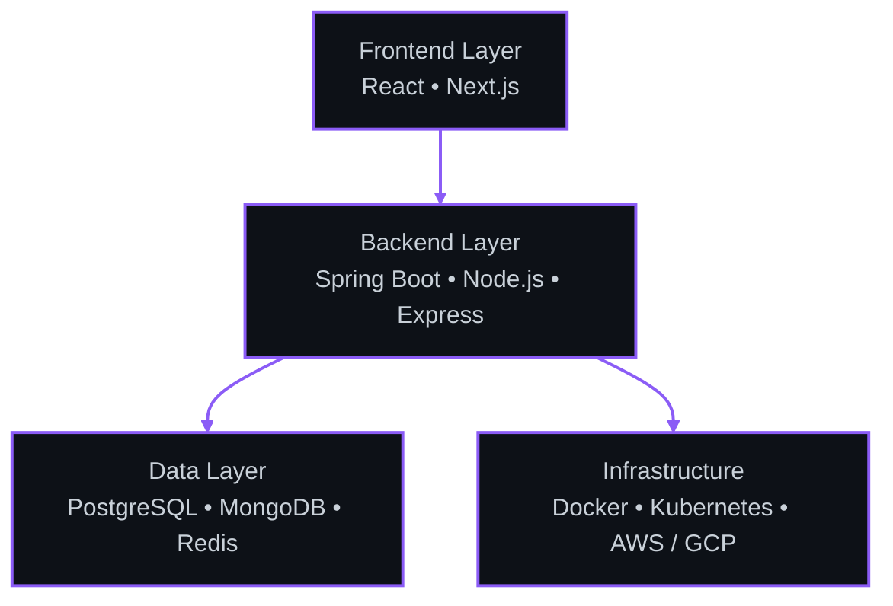

<!-- 1. Animated Waving Banner -->

 

<!-- 2. Animated Typing Subtitle -->

 

<!-- 3. Minimal Bio -->
<!-- [LIGHT MODE FIX] Removed hardcoded #c9d1d9 text color so the bio is perfectly legible on GitHub's light theme -->

  Full-stack engineer crafting scalable backend architectures and intuitive frontend experiences. Driven by clean code principles and a passion for building robust, high-performance systems from the ground up.

  

<!-- 4. Social Icons -->
<!-- Using flat-square to maintain 0px corner-radius. Background is #0d1117 to create a sleek aesthetic (looks like dark cards in light mode, floating text in dark mode). -->

  

---

 

  <h2 style="color: #8b5cf6;">Architecture & Tech Stack</h2>

 

#### Languages

 

#### Frameworks

 

#### Databases

 

#### DevOps

  

---

 

  <h2 style="color: #8b5cf6;">Dashboard & Stats</h2>

 

  <!-- GitHub Profile Trophies -->
  <!-- Hide C-rank and below. No-frame style for seamless integration. Switched to dracula theme for better purple integration. -->
  

 

  <!-- Side-by-side Stats and Top Languages -->
  <!-- Themed strictly to Phase 1: Background #0D1117, Title/Icon #8B5CF6, Text #C9D1D9, subtle border #8B949E, sharp edges (radius 0) -->
  
  

 

  <!-- GitHub Streak Stats -->
  <!-- Matching styling: background #0D1117, ring/fire/border #8B5CF6, dates #8B949E, text #C9D1D9 -->
  

 

  <!-- Animated Contribution Snake -->
  <!-- Note: Requires GitHub Action setup. Ensure you configure the Action with `color_snake=#8b5cf6` to match the accent color -->
  <picture>
    <source media="(prefers-color-scheme: dark)" srcset="https://raw.githubusercontent.com/Divyansh-h/Divyansh-h/output/github-contribution-grid-snake-dark.svg">
    <source media="(prefers-color-scheme: light)" srcset="https://raw.githubusercontent.com/Divyansh-h/Divyansh-h/output/github-contribution-grid-snake.svg">
    
  </picture>

  

---

 

<!-- Footer -->

  <!-- Subtle Profile View Counter matching the flat-square aesthetic -->
  

 

  <!-- Thin Animated Footer Wave mirroring the Header -->
  

