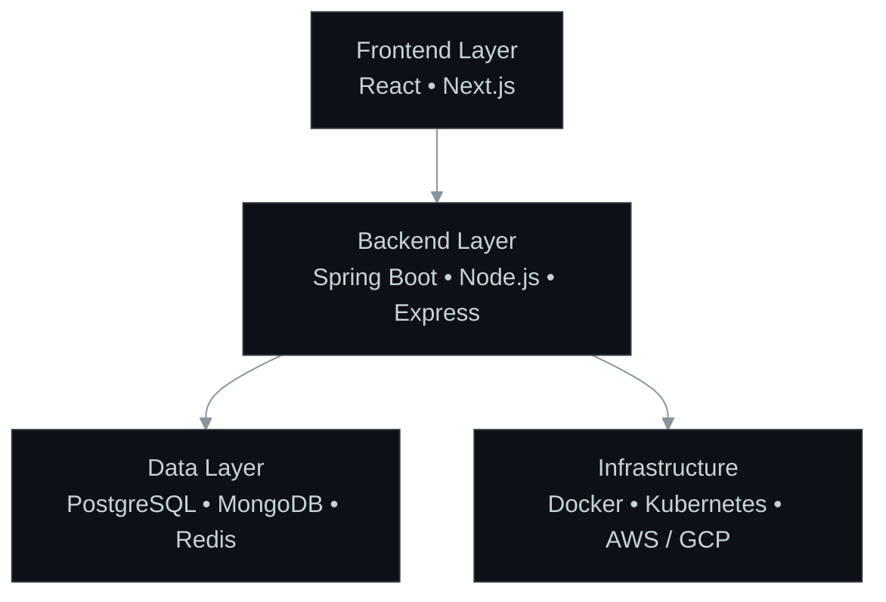

# Divyansh-h

**Backend Engineer | System Design Enthusiast | Clean Code Advocate**

 

  Full-stack engineer crafting scalable backend architectures and intuitive frontend experiences. Driven by clean code principles and a passion for building robust, high-performance systems from the ground up.

 

  

---

 

  <h2>Architecture & Tech Stack</h2>

 

#### Languages

 

#### Frameworks

 

#### Databases

 

#### DevOps

  

---

 

  <h2>Activity</h2>

 

  <!-- Monochrome Stats and Top Languages -->
  
  

 

  <!-- Monochrome Snake Grid -->
  <!-- Ensure you configure the Action with `color_snake=#ffffff` -->
  <picture>
    <source media="(prefers-color-scheme: dark)" srcset="https://raw.githubusercontent.com/Divyansh-h/Divyansh-h/output/github-contribution-grid-snake-dark.svg">
    <source media="(prefers-color-scheme: light)" srcset="https://raw.githubusercontent.com/Divyansh-h/Divyansh-h/output/github-contribution-grid-snake.svg">
    
  </picture>

 

  

